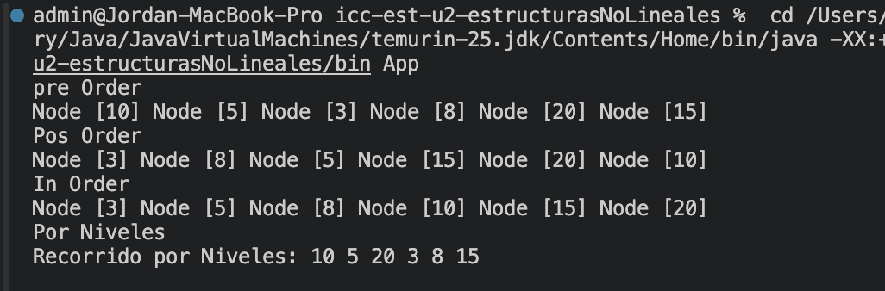
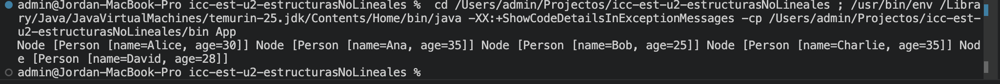
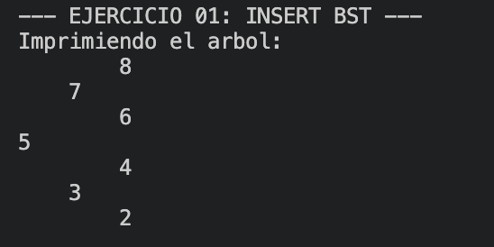
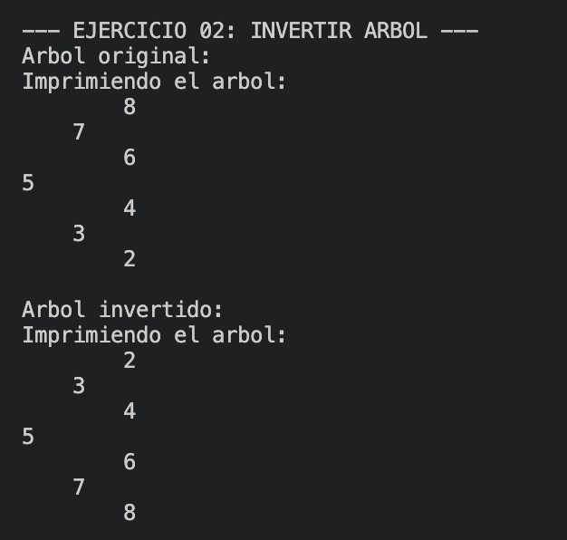
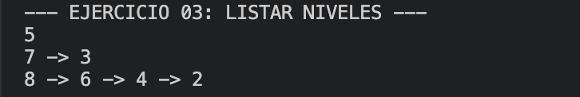
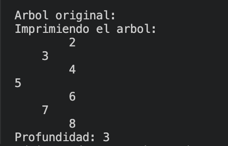

# Práctica: Estructuras Dinámicas No Lineales

## Datos del Estudiante
- **Nombre:** Jorda Sagbay
- **Curso:** grupo 3 
- **Fecha:** 09/0/2026

---

## 1. Implementación de estructuras no lineales

**Fecha:** 17/06/2026

**Descripción:**

Implementanmos metodos de arbolnpara asi recorrer el arbol de las distintas maneras vistas en clase 



![Captura de salida en consola]

### Captura del código de implementación del ejercicio 1

```java
public class IntTree {

    private Node<Integer> root;

    /// Constructor SIEMPRE inicializa LAS VARIABLES (ROOT)
    public IntTree() {
        this.root = null;
    }

    public boolean isEmpty() {
        return root == null;
    }

    public Node<Integer> getRoot() {
        return root;
    }

    public void setRoot(Node<Integer> node) {
        root = node;
    }

    public void setRoot(Integer value) {
        Node<Integer> node = new Node<Integer>(value);
        root = node;
    }

    public void insert(Integer value) { // 10
        Node<Integer> node = new Node<Integer>(value);
        root = insertRecursivo(root, node);
    }

    public void insert(Node<Integer> value) { // 10
        root = insertRecursivo(root, value);
    }

    // recursivo para insertar valores ARBOL BINARIO
    private Node<Integer> insertRecursivo(Node<Integer> actual, Node<Integer> nodeInsertar) {
        if (actual == null) {
            return nodeInsertar;
        }

        // validar si es mayoy o nenor y decidir si lo ingerso a la der o izq
        if (actual.getValue() > nodeInsertar.getValue()) {
            actual.setLeft(insertRecursivo(actual.getLeft(), nodeInsertar));
        } else {
            actual.setRight(insertRecursivo(actual.getRight(), nodeInsertar));
        }

        return actual;
    }

    public void preOrder() {
        preOrderRecursivo(root);
    }

    private void preOrderRecursivo(Node<Integer> actual) {
        if (actual == null)
            return;
        System.out.print(actual + " ");
        preOrderRecursivo(actual.getLeft());
        preOrderRecursivo(actual.getRight());
    }

    public void posOrder() {
        posOrderRecursivo(root);
    }

    private void posOrderRecursivo(Node<Integer> actual) {
        if (actual == null)
            return;
        posOrderRecursivo(actual.getLeft());
        posOrderRecursivo(actual.getRight());
        System.out.print(actual + " ");

    }
    private void inOrderRecursivo(Node<Integer> actual) {
        if (actual == null)
            return;
        inOrderRecursivo(actual.getLeft());
        System.out.print(actual + " ");
        inOrderRecursivo(actual.getRight());

    }
    public void inOrder() {
        inOrderRecursivo(root);
    }

    public void imprimirPorNiveles() {
    // 1. Si el árbol está vacío, no hay nada que imprimir 🕸️
    if (root == null) {
        System.out.println("El árbol está vacío.");
        return;
    }

    // 2. Creamos la cola y metemos la raíz para empezar 👑
    Queue<Node<Integer>> cola = new LinkedList<>();
    cola.add(root);

    System.out.print("Recorrido por Niveles: ");

    // 3. Mientras haya nodos en la cola, seguimos procesando 🔄
    while (!cola.isEmpty()) {
        // Sacamos al primero de la fila 🏃‍♂️
        Node<Integer> actual = cola.poll();
        
        // ¡Lo imprimimos! 🖨️
        System.out.print(actual.getValue() + " ");

        // 4. ¿Tiene hijo izquierdo? ¡Que se ponga a la fila! ⬅️👥
        if (actual.getLeft() != null) {
            cola.add(actual.getLeft());
        }

        // 5. ¿Tiene hijo derecho? ¡También a la fila! ➡️👥
        if (actual.getRight() != null) {
            cola.add(actual.getRight());
        }
    }
    System.out.println(); // Un salto de línea elegante al terminar 🏁
}
public int getAltura() {
    return getAlturaRecursivo(this.root);
}

// Método privado que hace el cálculo real usando recursividad 🕵️‍♂️
private int getAlturaRecursivo(Node<Integer> actual) {
    // Caso base: Si el nodo es nulo, su altura es 0 🕸️
    if (actual == null) {
        return 0; 
    }

    // 1. Conseguimos la altura de la rama izquierda ⬅️
    int alturaIzquierda = getAlturaRecursivo(actual.getLeft());

    // 2. Conseguimos la altura de la rama derecha ➡️
    int alturaDerecha = getAlturaRecursivo(actual.getRight());

    // 3. Comparamos cuál es mayor usando Math.max y le sumamos 1 👑
    return Math.max(alturaIzquierda, alturaDerecha) + 1;
}
private int getPeso(Node<Integer> actual) {
    // Caso base: Si el nodo es nulo, su peso es 0 🕸️
    if (actual == null) {
        return 0; 
    }

    // 1. Conseguimos la altura de la rama izquierda ⬅️
    int alturaIzquierda = getPeso(actual.getLeft());

    // 2. Conseguimos la altura de la rama derecha ➡️
    int alturaDerecha = getPeso(actual.getRight());

    // 3. Comparamos cuál es mayor usando Math.max y le sumamos 1 👑
    return (alturaIzquierda + alturaDerecha) + 1;
}
public int getPeso() {
    return getPeso(root);
}


    // inorder
    // niveles
    // altura    
}
```


## 2. Arboles con objetos 

**Fecha:** 17/06/2026
**Descripción:**
utilizamos el metodo no lineal de arboles para objetos 
.......

### Método implementado

```java
public class BinariTree<T extends Comparable<T>> {

    private Node<T> root;

    public BinariTree() {
        this.root = null;
    }

    public boolean isEmpty() {
        return root == null;
    }

    public Node<T> getRoot() {
        return root;
    }

    public void setRoot(Node<T> node) {
        root = node;
    }

    public void insert(T value) {
        Node<T> node = new Node<>(value);
        root = insertRecursivo(root, node);
    }

    private Node<T> insertRecursivo(Node<T> actual, Node<T> nodeInsertar) {
        if (actual == null) {
            return nodeInsertar;
        }

        if (actual.getValue().compareTo(nodeInsertar.getValue()) > 0) {
            actual.setLeft(insertRecursivo(actual.getLeft(), nodeInsertar));
        } else {
            actual.setRight(insertRecursivo(actual.getRight(), nodeInsertar));
        }

        return actual;
    }
    
    private void inOrderRecursivo(Node<T> actual) {
        if (actual == null)
            return;
        inOrderRecursivo(actual.getLeft());
        System.out.print(actual + " ");
        inOrderRecursivo(actual.getRight());

    }
    public void inOrder() {
        inOrderRecursivo(root);
    }

}
    
```
    



## 3. Ejercicio 1

**Fecha:** 22/06/2026

**Descripción:**

El método inicia el árbol binario imprimiendo el encabezado y llamando a la función auxiliar desde la raíz en el nivel cero para que la función auxiliar recorra recursivamente el árbol de forma inversa derecha a la raiz y a la  izquierda para mostrarlo visualmente de manera horizontal para por cada nodo visitado, imprime espacios en blanco dependiendo a su nivel de profundidad seguidos del valor numérico del nodo correspondiente.
### Captura del código de implementación del ejercicio 1
```java
public class Ejercicio1 {

    public void printTree(Node<Integer> root) {
        System.out.println("Imprimiendo el arbol:");
        printTreeRecursivo(root, 0);
    }

    private void printTreeRecursivo(Node<Integer> actual, int nivel) {

        if (actual == null) {
            return;
        }

        printTreeRecursivo(actual.getRight(), nivel + 1);

        for (int i = 0; i < nivel; i++) {
            System.out.print("    ");
        }

        System.out.println(actual.getValue());

        printTreeRecursivo(actual.getLeft(), nivel + 1);
    }
}
```
### Salida de consola



## 4. Ejercico 2

**Fecha:** 22/06/2026
**Descripción:**
El método principal pasa por la raíz a y de hay a la función auxiliar y finalmente la retorna modificada.
La función auxiliar recorre recursivamente el árbol y se detiene inmediatamente si encuentra un nodo nulo por  cada nodo, intercambia sus referencias izquierda y derecha usando una variable temporal antes de repetir el proceso en sus hijos.
.......

### Captura del código de implementación del ejercicio 2

```java
public class Ejercicio2 {

    public Node<Integer> invert(Node<Integer> root) {

        invertRecursivo(root);

        return root;
    }

    private void invertRecursivo(Node<Integer> root) {

        if (root == null) {
            return;
        }

        Node<Integer> temp = root.getLeft();
        root.setLeft(root.getRight());
        root.setRight(temp);

        invertRecursivo(root.getLeft());
        invertRecursivo(root.getRight());
    }

}
```
### Salida de consola

## 5. Ejercicio 3

**Fecha:** 23/06/2026

**Descripción:**

lo que realiza esta clase es un recorrido por niveles utilizando una cola lo hace cuando agrupa los nodos en listas diferentes según el nivel de profundidad en el que se encuentra para al final devolver una lista principal que contiene todos los niveles ordenados de arriba hacia abajo.
### Captura del código de implementación del ejercicio 3

```java
public class Ejercicio3 {

    public List<List<Node<Integer>>> listLevels(Node<Integer> root) {

        List<List<Node<Integer>>> resultado =
                new ArrayList<>();

        if (root == null) {
            return resultado;
        }

        Queue<Node<Integer>> cola =
                new LinkedList<>();

        cola.add(root);

        while (!cola.isEmpty()) {

            int cantidadNodos = cola.size();

            List<Node<Integer>> nivel =
                    new ArrayList<>();

            for (int i = 0; i < cantidadNodos; i++) {

                Node<Integer> actual = cola.poll();

                nivel.add(actual);

                if (actual.getLeft() != null) {
                    cola.add(actual.getLeft());
                }

                if (actual.getRight() != null) {
                    cola.add(actual.getRight());
                }
            }

            resultado.add(nivel);
        }

        return resultado;
    }
}
```
### Salida de consola

## 6. Ejercicio 4

**Fecha:** 23/06/2026

**Descripción:**

El codigo calcula la profundidad del árbol binario asi mismo con metodo recursivo primero Visita el subárbol izquierdo y derecho de cada nodo para obtener sus profundidades y despues al final toma el valor mayor entre ambos lados y le suma 1 contando el nodo actual para retornar el total.
### Captura del código de implementación del ejercicio 4

```java
public class Ejercicio4 {

    public int maxDepth(Node<Integer> root) {
        return maxDepthRecursivo(root);
    }

    private int maxDepthRecursivo(Node<Integer> actual) {

        if (actual == null) {
            return 0;
        }

        int izquierda = maxDepthRecursivo(actual.getLeft());

        int derecha = maxDepthRecursivo(actual.getRight());

        return Math.max(izquierda, derecha) + 1;
    }
}

```
### Salida de consola


